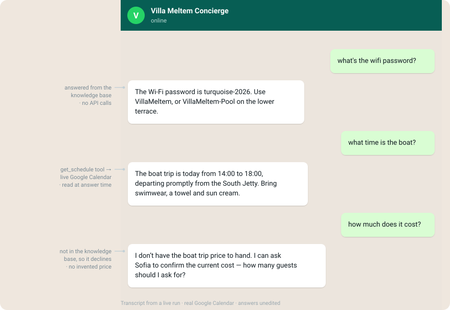
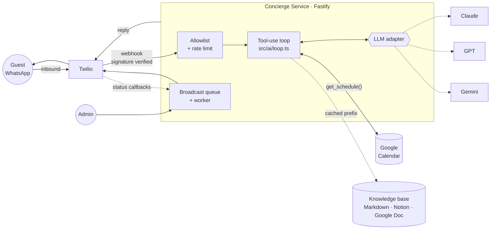
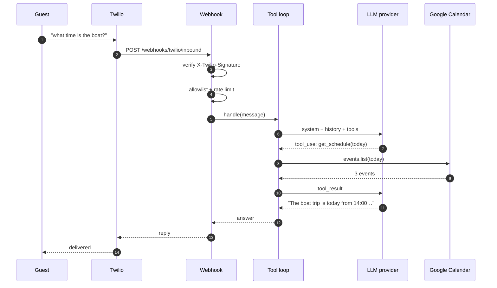
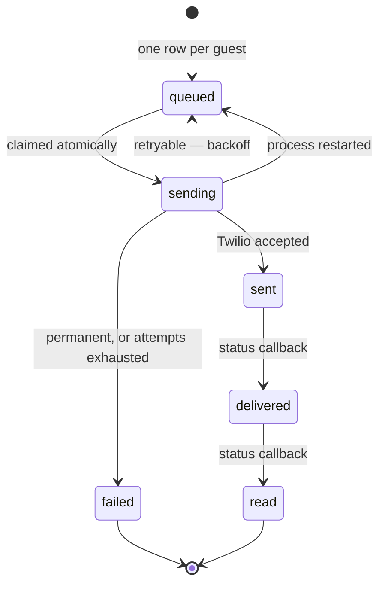
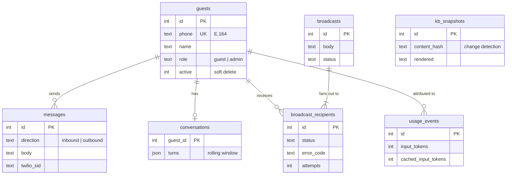
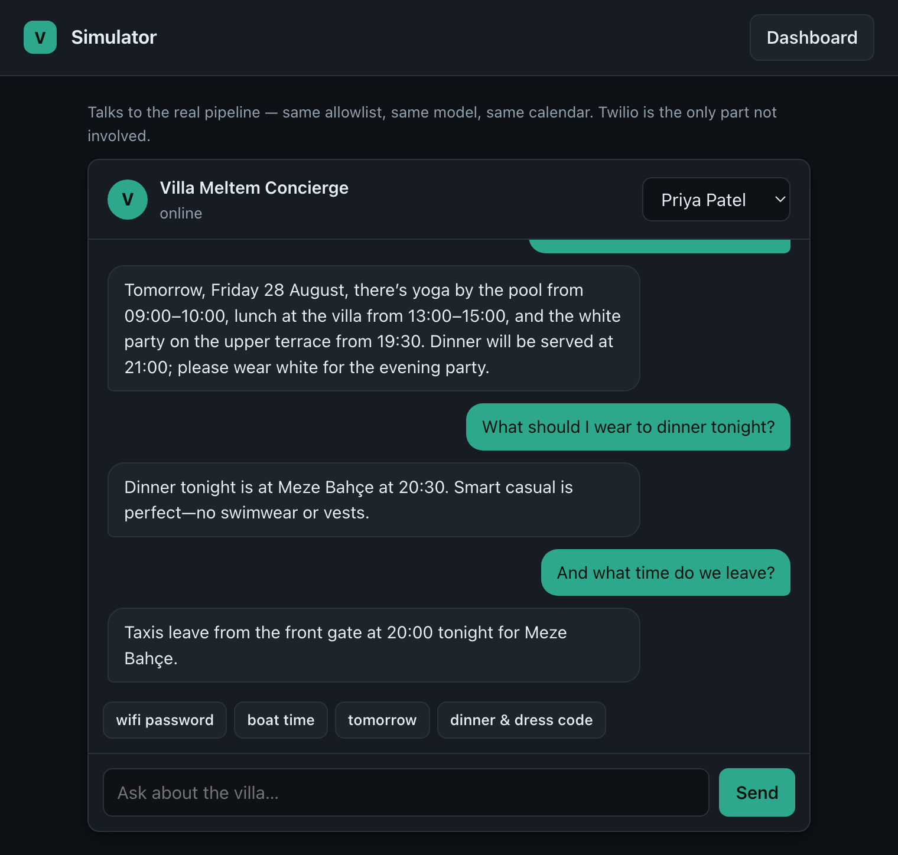
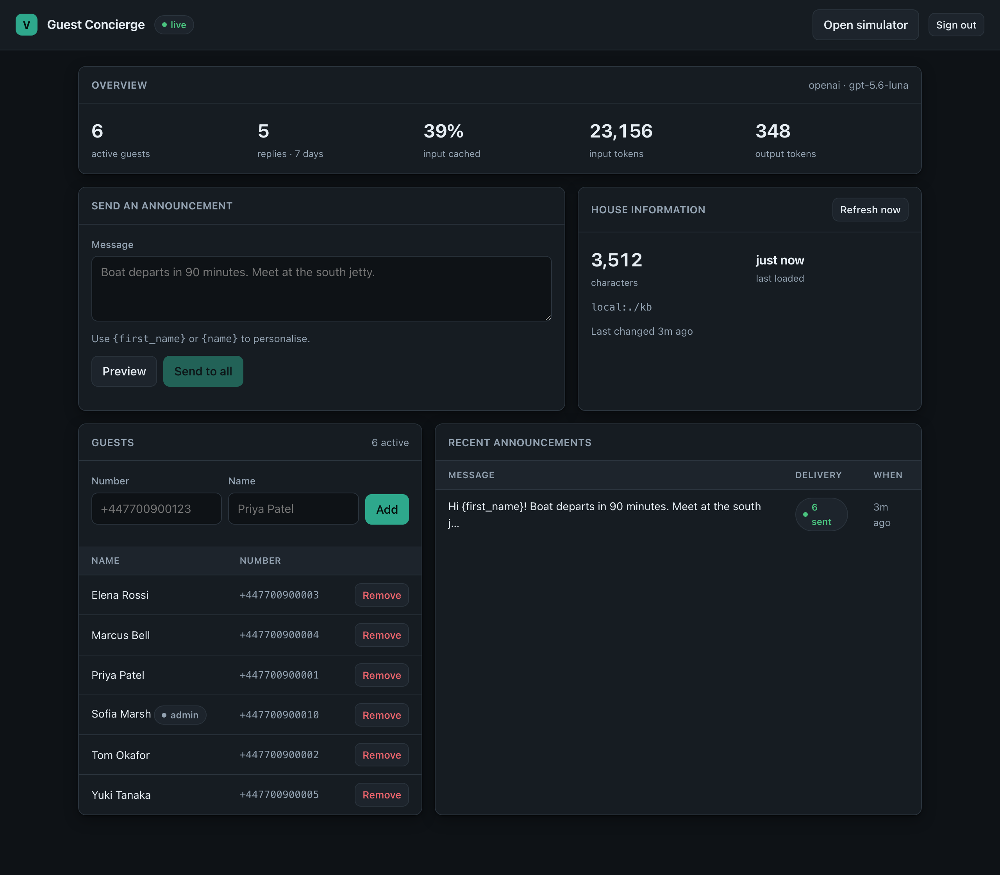

<h1 align="center">WhatsApp Guest Concierge</h1>

<p align="center">
  An AI concierge for private holiday groups.<br>
  Guests message one WhatsApp number and get instant, accurate answers about the
  villa, the schedule and the logistics — instead of texting the host forty times a day.
</p>

<p align="center">
  <a href="https://github.com/ilhanakbudak/whatsapp-guest-concierge/actions/workflows/ci.yml">
    </a>
  
  
  
  
</p>

<p align="center">
  <strong>Twilio WhatsApp</strong> · <strong>Claude / GPT / Gemini</strong> ·
  <strong>Google Calendar</strong> · <strong>Notion &amp; Google Docs</strong>
</p>

---

<p align="center">
  
</p>

<p align="center"><sub>
  Unedited transcript from a live run against a real Google Calendar.
  Reproduce it yourself with <code>npm run simulate -- "what time is the boat?"</code>
</sub></p>

---

## Contents

- [Why this isn't a ChatGPT wrapper](#why-this-isnt-a-chatgpt-wrapper)
- [Architecture](#architecture)
- [How a message is answered](#how-a-message-is-answered)
- [Broadcasts](#broadcasts)
- [Data model](#data-model)
- [Quickstart](#quickstart)
- [Configuration](#configuration)
- [Admin surface](#admin-surface)
- [Testing](#testing)
- [Deployment](#deployment)
- [Project status](#project-status)

---

## Why this isn't a ChatGPT wrapper

Four decisions do most of the work, and they're the reason this repo exists.

### 1. One tool-use loop, three providers

The agentic loop lives in [`src/ai/loop.ts`](src/ai/loop.ts) rather than inside a
vendor SDK helper, because the providers disagree about nearly everything: tool
schemas (`input_schema` vs `function.parameters` vs `functionDeclarations`), how
tool results are represented, whether the assistant role is called `assistant` or
`model`, and how prompt caching is expressed. Three thin adapters absorb all of
it, and [one conformance suite](tests/ai-conformance.test.ts) runs the same
assertions against all three.

Switching provider is one environment variable and an API key.

```bash
LLM_PROVIDER=anthropic   # or openai, gemini
```

### 2. The calendar is a tool call, not prompt stuffing

The obvious build dumps the next week of events into the system prompt on every
message. That's wrong twice: it's stale the moment the PA team moves the boat
departure, and it burns tokens on the 90% of messages that are about WiFi
passwords.

Instead the model gets a `get_schedule` tool and calls it only when a question is
actually schedule-shaped — so the answer reflects a change made sixty seconds ago,
and *"what's the wifi?"* never touches Google at all.

### 3. The knowledge base is a cache breakpoint

The villa handbook is a few thousand near-static tokens sent on every request. It
sits first in the system prompt behind an explicit `cache_control` breakpoint,
with volatile content — current time, guest name — placed strictly after it.

Ordering is enforced by the prompt builder and [asserted in
tests](tests/ai-loop.test.ts), because a silently broken prompt cache is invisible
until the bill arrives. When the source document hasn't changed, the service
returns the **byte-identical string** rather than an equivalent rebuild, for the
same reason.

> Measured across a live session: **44% of input tokens served from cache**.

### 4. Broadcasts are a queue, not a for-loop

`await Promise.all(guests.map(send))` looks fine until Twilio rate-limits you
halfway through and nobody can tell which of twelve guests actually heard that the
boat leaves in ninety minutes.

Every broadcast writes one row per recipient, drained by a worker with bounded
concurrency, exponential backoff and delivery receipts fed back from Twilio's
status webhook. Restart the process mid-broadcast and it resumes where it stopped.

---

## Architecture



Every external dependency sits behind an interface with a mock implementation, so
the whole system runs with no credentials at all.

---

## How a message is answered



An unauthorised number is declined **before** the loop is entered — otherwise
anyone who discovered the number could spend the client's tokens.

---

## Broadcasts



The claim moves a row out of `queued` in the same statement that selects it, so
two workers can never take the same recipient. Rows stranded in `sending` by a
crash are requeued on boot: we don't know whether Twilio accepted them, and a
duplicate announcement is a far smaller problem than a guest never hearing that
the boat is leaving.

Failures are reported in words the team can act on:

> *Outside the 24-hour window — this guest must message the bot first*

---

## Data model



Removing a guest deactivates them rather than deleting: message history and past
delivery records survive.

---

## Quickstart

No accounts, no API keys, under a minute.

```bash
git clone https://github.com/ilhanakbudak/whatsapp-guest-concierge
cd whatsapp-guest-concierge
npm install
cp .env.example .env      # DEMO_MODE=true is already the default
npm run seed              # a sample villa: guests, itinerary, handbook
npm run dev
```

`npm run seed` prints the itinerary the bot will answer from:

```
guests 6 added, 0 updated (6 total)
kb     5 written, 0 left alone
agenda 11 events across 11 seeds (timezone Europe/Istanbul)

today (Thursday 27 August)
  08:30–10:30  Breakfast on the terrace (Main terrace)
  14:00–18:00  Boat trip to the blue caves (South jetty) — Bring swimwear…
  20:30–21:30  Dinner at Meze Bahçe (Kalkan old town) — Smart casual…
```

Then talk to it without a phone:

```bash
npm run simulate -- "what time is the boat today?"
```
```
POST http://localhost:3000/webhooks/twilio/inbound
> what time is the boat today?

HTTP 200  [2998ms]
< The boat trip is today from 14:00 to 18:00, departing promptly
  from the South Jetty.
```

Or open **http://localhost:3000/simulator** and talk to it in the browser:

<p align="center">
  
</p>

The simulator drives the real pipeline — same allowlist, same model, same
calendar. Only Twilio is left out. It is served outside production by default,
and requires the admin token if a deployed instance turns it on.

In demo mode Twilio and Google Calendar are replaced by in-memory fakes seeded
with a plausible villa dataset. The AI path is real if you set an API key, and
stubbed if you don't.

### Going live

Real credentials, the Twilio sandbox, the Google service account and the Notion or
Google Doc wiring are covered step by step in **[docs/SETUP.md](docs/SETUP.md)**,
written to be followed by a non-technical operations team.

Don't have a calendar to test against? The service account can create and populate
one itself:

```bash
npm run setup:calendar
```

---

## Configuration

### LLM provider

| `LLM_PROVIDER` | Default model | Key |
|---|---|---|
| `anthropic` | `claude-opus-5` | `ANTHROPIC_API_KEY` |
| `openai` | `gpt-5.6-terra` | `OPENAI_API_KEY` |
| `gemini` | `gemini-3.7-flash` | `GEMINI_API_KEY` |
| `mock` | — | none — deterministic, for tests |

A model that doesn't match its provider is rejected at boot rather than failing on
a guest's first message.

### Knowledge base

| `KB_PROVIDER` | Source | Use when |
|---|---|---|
| `local` | Markdown files in `kb/` | Default; version-controlled, no accounts |
| `notion` | A Notion page | The team already lives in Notion |
| `google-doc` | A Google Doc | The team already lives in Google Docs |

Fetched on a daily cron and refreshable on demand. If the source is unreachable
the bot serves the last stored copy rather than losing its house knowledge for the
duration of someone else's outage.

### Running one integration live

Each integration can be mocked independently, so you can bring up Twilio before
you have a Google project:

```bash
DEMO_MODE=false
CALENDAR_DEMO=true
LLM_DEMO=true
```

---

## Admin surface

<p align="center">
  
</p>

Three ways in, because the people running a holiday don't want to open a laptop.

### Dashboard

Served at `/dashboard`. Plain HTML and `fetch` — no framework and no build step,
because four buttons do not justify a bundler and the brief called out
over-engineering. Responsive, keyboard accessible, and it follows the operating
system's light or dark theme.

### WhatsApp commands

The team can run the important operations by text, from a boat:

```
!broadcast Boat departs in 90 minutes. Meet at the south jetty.
  → Ready to send to 6 guests:
    "Hi Elena! Boat departs in 90 minutes. Meet at the south jetty."
    Reply !confirm to send, or !cancel to discard.

!confirm   → Sending to 6 guests now.
```

**`!broadcast` never sends on its own.** It stages the message, shows it rendered
for a real guest, and waits for an explicit `!confirm` — which expires after five
minutes, because confirming an announcement composed an hour ago could send
something no longer true.

| Command | |
|---|---|
| `!status` | Guests, knowledge-base freshness, model, 24-hour usage |
| `!guests` | List active guests |
| `!add <number> <name>` | Add or reactivate |
| `!remove <number>` | Deactivate |
| `!refresh` | Reload the house information now |
| `!broadcast` / `!confirm` / `!cancel` | Staged announcements |

Commands are routed on the `!` prefix rather than by asking the model to
classify, so a command never costs a token and a typo like `!brodcast` gets
*"Did you mean !broadcast?"* instead of being answered conversationally by a model
that cannot actually send anything. Non-admins get a deliberately vague refusal —
a guest does not need to learn the command surface.

### HTTP API

Every endpoint takes `Authorization: Bearer $ADMIN_API_TOKEN`.

| Endpoint | |
|---|---|
| `POST /admin/broadcast` | Queue an announcement (`"dryRun": true` to preview) |
| `GET /admin/broadcasts` | Recent broadcasts with delivery rollups |
| `GET /admin/broadcasts/:id` | Per-recipient status, errors, attempt counts |
| `GET /admin/kb` | What's loaded, and when it last changed |
| `POST /admin/kb/refresh` | Push a document edit live now |
| `GET /admin/guests` · `POST` · `DELETE /admin/guests/:phone` | Manage the allowlist |
| `GET /admin/usage` | Token spend and prompt-cache hit rate |

**Always preview first** — a broadcast reaches every guest at once and cannot be
recalled:

```jsonc
{
  "dryRun": true,
  "recipientCount": 12,
  "placeholders": ["{first_name}"],
  "samples": [
    { "name": "Priya Patel", "phone": "+4477****0001",
      "body": "Hi Priya! Boat departs in 90 minutes. Meet at the south jetty." }
  ],
  "warnings": []
}
```

A misspelled placeholder (`{frist_name}`) becomes a warning rather than being sent
verbatim to everyone.

Day-to-day runbooks are in **[docs/OPERATIONS.md](docs/OPERATIONS.md)**.

---

## Testing

```bash
npm run verify    # exactly what CI runs, fail-fast
```

**364 tests.** The ones that earn their keep:

| Area | What is actually asserted |
|---|---|
| Provider conformance | One suite × three adapters — tool translation, usage normalisation, error wrapping |
| Prompt caching | The cacheable prefix stays byte-identical as time and guest change |
| Timezones | DST transitions, 45-minute offsets, all-day events, 23- and 25-hour days |
| Webhook security | Tampered body, wrong URL, wrong auth token, missing signature |
| Broadcasts | One bad number doesn't silence the others; a restart doesn't double-send |
| Knowledge base | Hash short-circuit, stale-copy fallback, Notion pagination |

`npm run verify` also **boots the compiled output** and probes it, because vitest's
transpiler is more forgiving about CommonJS interop than real ESM — a named import
from a CJS dependency can pass every test and still crash on start.

### Diagnostics

| Command | |
|---|---|
| `npm run check:twilio` | Sender, who has joined, whose 24-hour window is open |
| `npm run check:calendar` | Credentials, visible calendars, and the configured ID |
| `npm run check:llm` | Real questions through the real provider, with token cost |
| `npm run simulate -- "…"` | Post a correctly-signed webhook, no phone needed |

---

## Deployment

Designed for Railway or Render: one process, one SQLite file, no external
services required.

```bash
npm run build && npm start
```

`GET /health` for liveness, `GET /health/ready` for readiness. Full walkthrough in
**[docs/DEPLOYMENT.md](docs/DEPLOYMENT.md)**.

### About the stack

The brief specified Twilio, Claude, Google Calendar, n8n and Railway/Render. This
implementation follows that, with two documented judgements:

**n8n orchestrates, it doesn't host the logic.** Signature verification, a tool-use
loop and a retrying broadcast queue are code, and code belongs in a repository
where it can be reviewed and tested. [`n8n/`](n8n/) ships importable workflows for
the jobs n8n is genuinely good at.

**The model is configurable.** The brief named `claude-sonnet-4-20250514`, since
retired. `LLM_MODEL=claude-sonnet-5` is the current Sonnet-class equivalent.

---

## Project status

| Phase | |
|---|---|
| Scaffold, config, storage | ✅ |
| Twilio inbound + signature verification | ✅ |
| Google Calendar integration | ✅ |
| LLM tool-use loop (Claude / GPT / Gemini) | ✅ |
| Knowledge base: Markdown, Notion, Google Doc | ✅ |
| Broadcast queue + delivery tracking | ✅ |
| Admin dashboard + WhatsApp commands | ✅ |
| Docker, deploy config, n8n workflows | 🚧 |

## Documentation

| | |
|---|---|
| [docs/SETUP.md](docs/SETUP.md) | Twilio, Google and Notion setup for an ops team |
| [docs/OPERATIONS.md](docs/OPERATIONS.md) | Day-to-day: announcements, guests, KB updates |
| [docs/ARCHITECTURE.md](docs/ARCHITECTURE.md) | Request lifecycle, tool-use flow, broadcast flow |
| [docs/DEPLOYMENT.md](docs/DEPLOYMENT.md) | Railway and Render |

## License

MIT
