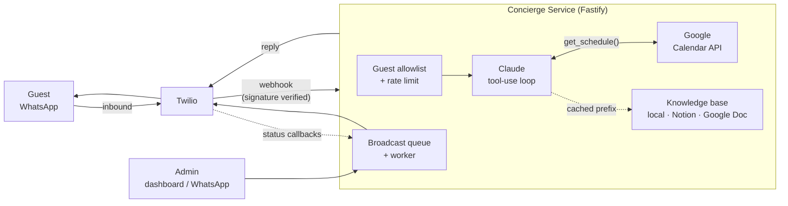

# WhatsApp Guest Concierge

An AI concierge for private holiday groups. Guests message one WhatsApp number and
get instant, accurate answers about the villa, the schedule, and the logistics —
instead of texting the host forty times a day.

Built on **Twilio WhatsApp**, the **Claude API**, and the **Google Calendar API**,
with a durable broadcast system for pushing announcements to every guest at once.

> 🚧 **Under active development.** Phase status is tracked below.

---

## Why this isn't a ChatGPT wrapper

Three decisions do most of the work, and they're the reason this repo exists:

**1. One tool-use loop, three providers.**
The agentic loop lives in `src/ai/loop.ts` rather than inside a vendor SDK
helper, because Anthropic, OpenAI and Gemini disagree about nearly everything:
tool schemas (`input_schema` vs `function.parameters` vs `functionDeclarations`),
how tool results are represented, whether the assistant role is called
`assistant` or `model`, and how prompt caching is expressed. Three thin adapters
absorb all of it and a single conformance suite runs the same assertions against
all of them. Switching provider is `LLM_PROVIDER=` plus an API key.

**2. The calendar is a tool call, not prompt stuffing.**
The obvious build dumps the next week of calendar events into the system prompt on
every message. That's wrong twice: it's stale the moment the PA team moves the boat
departure, and it burns tokens on the 90% of messages that are about WiFi
passwords. Instead Claude gets a `get_schedule` tool and calls it only when a
question is actually schedule-shaped — so the answer reflects a change made sixty
seconds ago, and a "what's the wifi?" message never touches Google at all.

**3. The knowledge base is a cache breakpoint.**
The villa handbook is a few thousand near-static tokens sent on every single
request. It sits first in the system prompt behind an explicit
`cache_control` breakpoint, with volatile content (current time, guest name) placed
strictly after it. Ordering is enforced by the prompt builder and asserted in
tests, because a silently broken prompt cache is invisible until the bill
arrives. Measured against the live API, 45% of input tokens are served from
cache across a four-message conversation.

**4. Broadcasts are a queue, not a for-loop.**
`await Promise.all(guests.map(send))` looks fine until Twilio rate-limits you
halfway through and nobody can tell which of the twelve guests actually heard that
the boat leaves in ninety minutes. Every broadcast writes one row per recipient and
is drained by a worker with bounded concurrency, exponential backoff, and delivery
receipts fed back from Twilio's status webhook. A recipient outside WhatsApp's
24-hour session window is failed with a reason the team can act on rather than
retried into the same wall. Restart the process mid-broadcast and it resumes
where it stopped.

---

## Architecture



Every external dependency sits behind an interface with a mock implementation, so
the whole system runs with no credentials at all.

---

## Quickstart (no credentials needed)

```bash
git clone https://github.com/ilhanakbudak/whatsapp-guest-concierge
cd whatsapp-guest-concierge
npm install
cp .env.example .env      # DEMO_MODE=true is already the default
npm run seed              # loads a sample villa: guests, itinerary, handbook
npm run dev
```

Then open:

| URL | What it is |
|---|---|
| http://localhost:3000/simulator | A WhatsApp-style chat that runs the real pipeline |
| http://localhost:3000/dashboard | Broadcast composer, guest list, delivery log, token spend |

In demo mode Twilio, Google Calendar, and the knowledge base are replaced with
in-memory fakes seeded with a plausible villa dataset. The AI path is real if you
set `ANTHROPIC_API_KEY`, and stubbed if you don't.

Try asking the simulator:

- *"what's the wifi password?"* — answered from the knowledge base, no API calls
- *"what time is the boat tomorrow?"* — triggers a `get_schedule` tool call
- *"where do I go for dinner tonight and what's the dress code?"* — both sources

## Going live

Real credentials, the Twilio sandbox, the Google service account, and the Notion or
Google Doc wiring are all covered step by step in **[docs/SETUP.md](docs/SETUP.md)**,
written to be followed by a non-technical operations team.

---

## Admin surface

Two ways in, because the people running a holiday don't want to open a laptop.

**Web dashboard** — compose and preview a broadcast, add or remove guests, watch
per-recipient delivery status, refresh the knowledge base, see token spend.

Announcements support `{first_name}` and `{name}`, and every send is previewed
first — a message to every guest at once is not undoable, so the dashboard shows
the rendered text and the exact recipient count before anything is queued.

**WhatsApp commands** — message the bot from a configured admin number:

```
!broadcast Boat departs in 90 minutes. Meet at the south jetty.
!guests
!add +447700900123 Priya
!remove +447700900123
!refresh
!help
```

---

## Knowledge base

Point `KB_PROVIDER` at whichever source the team prefers to maintain:

| Provider | Source | Use when |
|---|---|---|
| `local` | Markdown files in `kb/` | Default; version-controlled, no accounts |
| `notion` | A Notion page | The team already lives in Notion |
| `google-doc` | A Google Doc | The team already lives in Google Docs |

Fetched on a daily cron and refreshable on demand via `POST /admin/kb/refresh`.
Content is hashed, so an unchanged document stores no new snapshot **and returns
the byte-identical string** — which is what keeps the prompt cache warm. If the
source is unreachable the bot serves the last stored copy rather than losing its
house knowledge for the duration of someone else's outage.

---

## About the stack

The brief specified Twilio, Claude, Google Calendar, n8n, and Railway/Render. This
implementation follows that, with two documented judgements:

**n8n orchestrates, it doesn't host the logic.** Signature verification, a tool-use
loop, and a retrying broadcast queue are code, and code belongs in a repository
where it can be reviewed and tested. `n8n/` ships importable workflows for the jobs
n8n is genuinely good at — the daily knowledge-base refresh and a daily delivery
summary.

**The LLM provider is swappable.** The brief named the Claude API, and Claude is
the default — but the tool-use loop lives in this repo rather than inside a vendor
SDK, so `LLM_PROVIDER=anthropic|openai|gemini` plus the matching API key is the
entire switch. The brief also named `claude-sonnet-4-20250514`, which has since
been retired; `LLM_MODEL=claude-sonnet-5` is the current Sonnet-class equivalent.
A model that doesn't match its provider is rejected at boot rather than failing on
a guest's first message.

---

## Project status

| Phase | |
|---|---|
| Scaffold, config, storage | ✅ |
| Twilio inbound + signature verification | ✅ |
| Google Calendar integration | ✅ |
| LLM tool-use loop (Claude / GPT / Gemini) | ✅ |
| Knowledge base: local Markdown, Notion, Google Doc + refresh | ✅ |
| Broadcast queue + delivery tracking | ✅ |
| Admin dashboard + WhatsApp commands | ⬜ |
| Docker, deploy config, n8n workflows | ⬜ |
| Documentation + demo | ⬜ |

## Documentation

- [docs/ARCHITECTURE.md](docs/ARCHITECTURE.md) — request lifecycle, tool-use flow, broadcast flow
- [docs/SETUP.md](docs/SETUP.md) — Twilio, Google and Notion setup for an ops team
- [docs/OPERATIONS.md](docs/OPERATIONS.md) — day-to-day: KB updates, guests, broadcasts
- [docs/DEPLOYMENT.md](docs/DEPLOYMENT.md) — Railway and Render

## License

MIT
